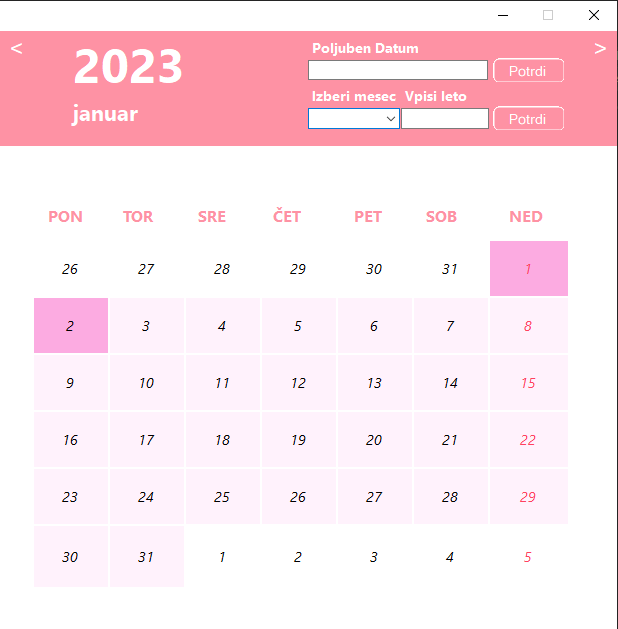

# Koledar_projekt
Enostaven grafičen koledarček.
---
- V koledarčku se prikazujejo dnevi v trenutno izbranem mesecu in letu.
- Mesec in leto lahko poljubno spremenimo (mesec izberemo s combo box-om; seznam izbir, leto pa vpišemo v polje), ob tem se prikažejo ustrezni dnevi.
- Poleg tega je mogoče vpisati poljuben datum v polju na koledarju, ki bo povzročil "skok" na ustrezen prikaz meseca v letu.
- Nedelje so označene z drugo barvo.
- Program pri odpiranju prebere vsebino datoteke s seznamom dni in oznako ali je praznik ponavljajoč (navadna ASCII datoteka, ki vsebuje datume in oznako za ponavljanje, ločeni z poljubnim znakom), ki predstavljajo praznike.
- Prazniki so spet drugače označeni, kot ostali dnevi na koledarju.
- Dnevi so prikazani v vrsticah, oziroma 7 dni v eni vrstici.
---
Za prikaz programa **Poženi ``.exe`` datoteko**
---
  
